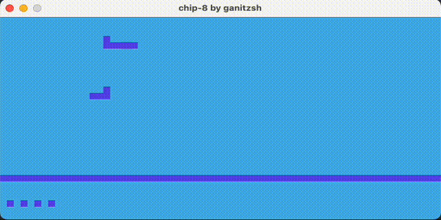

# Chip-8 Emulator



This is yet another chip-8 emulator! In fact, I've always wanted to code an
emulator, I'm a big user of the ones for recent consoles and it just fascinates
me.

This is part of my journey of learning Rust, trying to get the basics right. I'm
also following a very good book,
[Rust in Action](https://www.manning.com/books/rust-in-action), which elaborates
on advanced concepts and things about the language.

## Getting started

If your environment is setup for Rust:

```
cargo run
```

For now the rom is hard-coded, but I'll make changes and this will be addressed.
In the meantime, feel free to edit it.

## TODO

This emulator is not complete and probably not accurate, a list of things left
to be done include:

- Move video to its own module
- Store letters in memory
